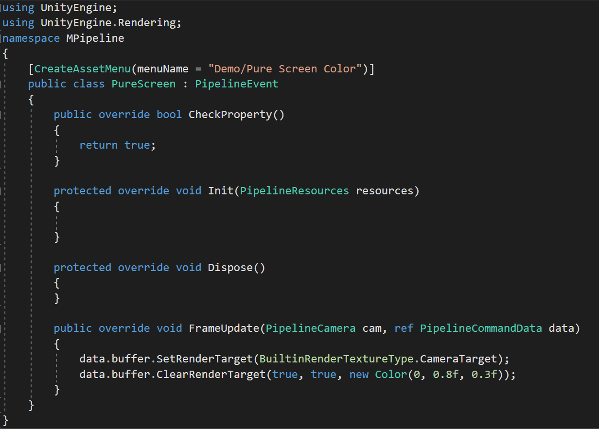
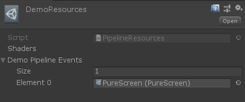
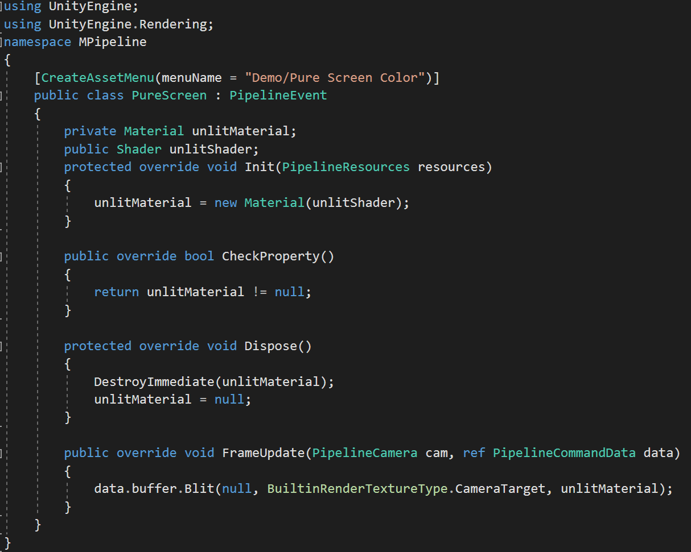
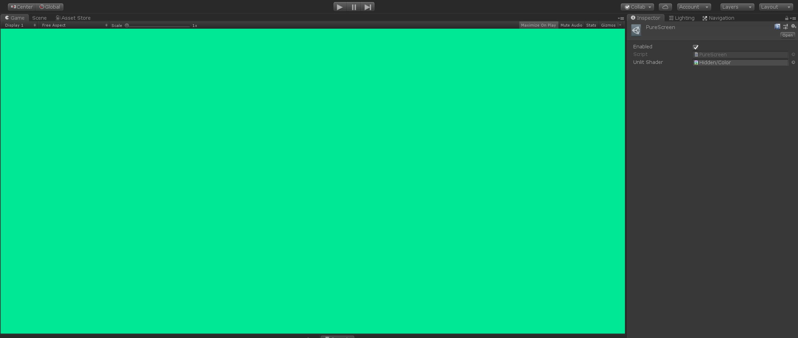
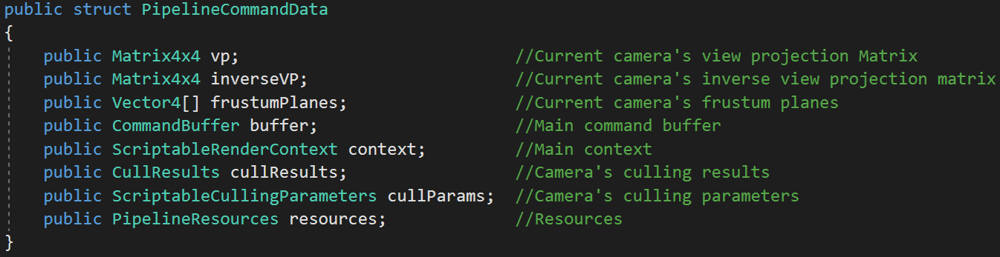
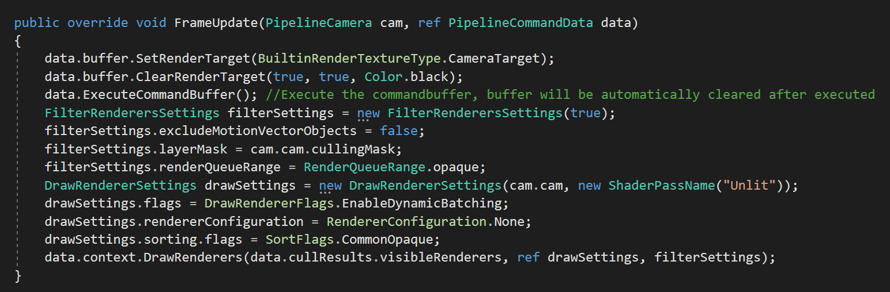
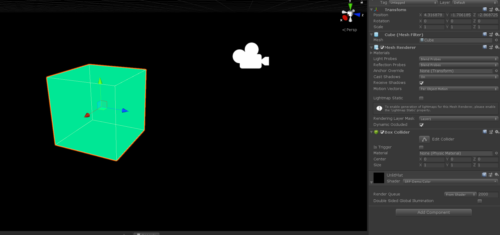

# MPipeline Framework
## Abstract:
* MPipeline framework is a design pattern for Unity graphics programmers to develop there own rendering pipeline by using SRP. The goal of developing such a design pattern is, to enhance team-work's efficiency, reducing the coupling between different parts of rendering, and helping project resources management. MPipeline is an object-oriented based framework, store and manage data by using Unity Editor's serialize system.
## Features:
* Designed for Scriptable Rendering Pipeline
* Job System supported
* Toolbox and utility functions supported
* Based on event-system design, reduce high-level coupling.
## Tutorial for Beginners:
### 1. Helloworld!
Before reading this tutorial, I hope you have already studied the basic API in SRP and CommandBuffer, the first "Helloworld" event will be drawing a pure color onto screen, which should be easy to do. Firstly lets create a new script called "PureScreen.cs", and then type such code:

We will start to look at these lines, as we declared, all of the rendering events will be ScriptableObject, so we definitely want to create such a instance in editor during developing, so we will have this:    [CreateAssetMenu(menuName = "Demo/Pure Screen Color")], you could easily create one in the Project window. Then we will write two lines of code in FrameUpdate method, this method will be called by the main pipeline later, to set screen as the render target and clear it into a half blue half green color. You do not have to execute the command buffer manually unless it is necessary, the main pipeline code will do it for you.
After having a ScriptableObject instance in your project's folder, we can start doing the second step: create the main pipeline's resources. You can press right mouse button in Project window and click "Create Assets/MPipeline/Create Resources", this will give you a  ScriptableObject of main pipeline, open it and it should be looks like this:

Then drag the PureScreen object we have already created at the last step into the "Demo Pipeline Events" array, just like the picture showed, and now our first pipeline is finished! you can drag this object into "Edit/Project Settings/Graphics" on the menu now. But how do we use the pipeline? The answer is quite simple, you need only add a component "PipelineCamera.cs" onto the target camera, then this camera will be available for your custom pipeline, there is a enum setting called "rendering path" in PipelineCamera.cs, this enum is just like Camera.RenderingPath in the legacy rendering pipeline, that means you can have multiple different rendering path for different camera, like unlit, forward, deferred, etc. We will discuss this later.
### 2. Property!
Having properties is the most important step in a rendering pipeline, like material, no matter PostProcessing, or Skybox, they all need a material, and now we will show you how to create a property or properties inside the rendering events. In the helloworld step, we can see there are three methods called "Init", "CheckProperty" and "Dispose", that will be called while the main pipeline is initializing and disposing, just like Awake and OnDestroy in MonoBehaviour classes. CheckProperty method is design to prevent Unity editor accidentially remove or dispose some native properties, this method will only be called in Editor mode. So we will create the properties inside Init method, and dispose it(if necessary) in the Dispose method, For example, lets use a material to redo the helloworld again:

As you can see, we are loading the material from "unlitShader", which is a regular serialized value, you can also store and load some properties in PipelineResources, the advantage to store resources in PipelineResources is the developing team could manage a unique piece of resources, and the disadvantage is such behavior may produce more coupling, for now, we just create the material from local variable just for Demo. After compiling code, we can add the new shader into the resources and load the pipeline(you always want to disload the pipeline when you are working on that, otherwise some errors or crashes may happened):

### 3. Use SRP's API!
As we declared before, MPipeline is an SRP based framework, so we passed the necessary datas from PipelineCommandData, which is a struct:

The comment is pretty clear enough, so we can just write a simple pure-color pipeline drawing onto the screen:

It is a pretty simple and clear demo code here, just draw a single pass which has tag "LightMode" = "Unlit", the result will be looks like this:

